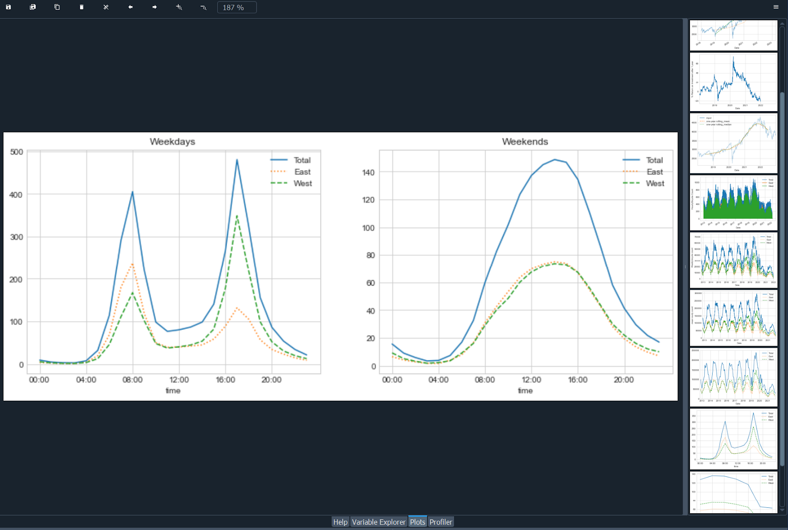
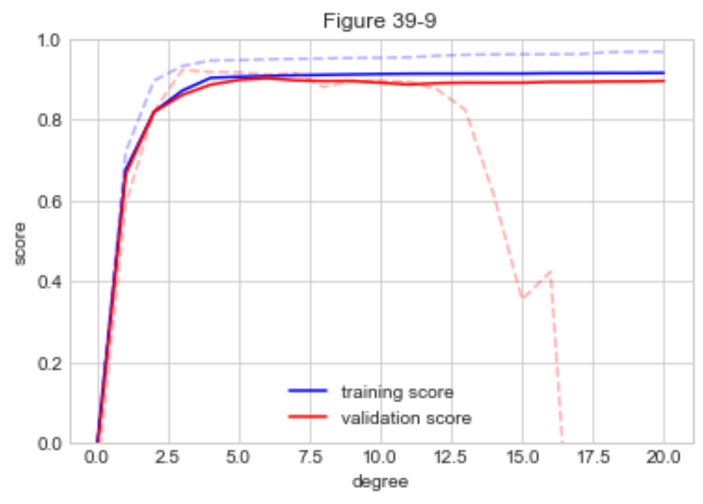
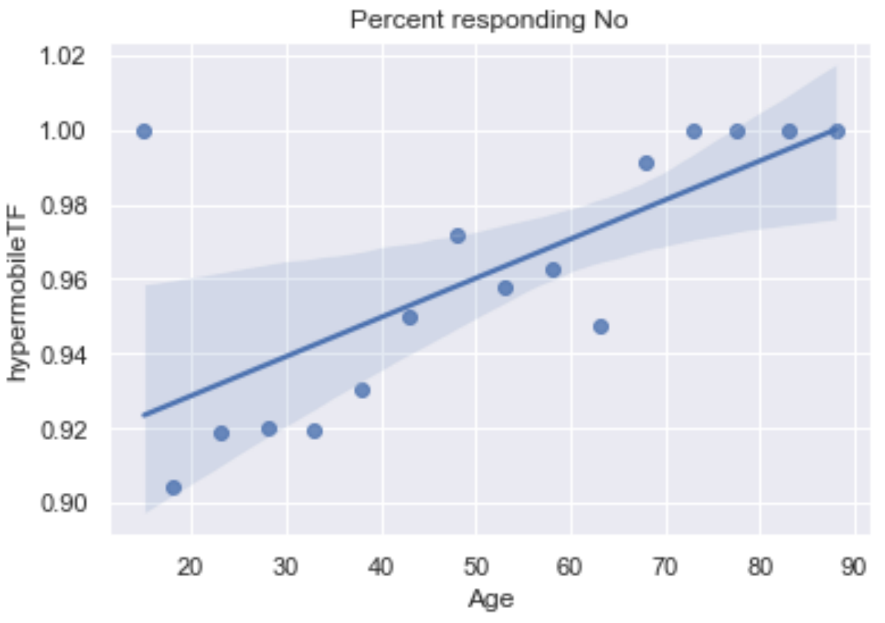

# Python Data Science Handbook
Book review of Python Data Science Handbook

The web site [Astral Codex Ten](https://astralcodexten.substack.com/) does a series of posts each year where they pass along book reviews from readers. For the 2023 version, I submitted a review of the Python Data Science Handbook book. They passed on my review, but since I went through the trouble to do it and get Google’s permission that I could post it (they have very tight copyright claims), I figured I would put it up here. Warning, very long for a typical book review.

This is a review of an O’Reilly book, so something between a textbook and a “how to” book. It’s a different book than most of the book review targets for Astral Codex Ten. Still, given the audience of the site and the topic, I thought it might be interesting to the readership. I was looking for something that would get me back into doing some data analysis. So, if you know some Python and some data analysis, is this a good book to refresh and get some practice on those topics? Yes, it’s pretty good, even without any previous data analysis experience. For me, the book ticked a number of boxes:
* It uses Python
* The second edition was just released, so it should use a fairly recent version of Python 3
* The modules I wanted to learn and the ones used by the book overlap nicely (NumPy, Pandas, and SciPy)
* The book recommends Anaconda, which is the version of Python I already use
* It is focused on local execution. I didn’t want to mix in cloud services or how to tackle very large (>10GB datasets)
* It has a free, on-line version. I bought [the Kindle version at Amazon](https://www.amazon.com/Python-Data-Science-Handbook-VanderPlas-ebook/dp/B0BP8XD42X/ref=tmm_kin_swatch_0), but I really like imagining I could give a class at a local library or community center for free

While reading the book, with this review in mind, I noticed a few things about formatting worth mentioning. First, a few of the Amazon reviews mentioned that the print version was in black and white. I was going to read mainly on a new Kindle Scribe, so I was going to end up there anyway and thought that it might be a feature in my case. It turns out, things are weird these days. The book looked great on the Scribe and the images didn’t seem to suffer too much from being in B&W at first. However, all the figures seemed to be wrong. After I was sure that it was not just me, I put in an errata on the web site for the book (at least I could do that easily). After working another chapter, it was intolerable and I went to leave a review on Amazon in case no one was looking at the errata. As soon as I hit submit and went back to the book, it auto-updated and all the figures were fine. I assume the printed book was fine because someone looked before ordering a few pallets worth of them. I also submitted more minor coding errors that I assume were not caught, but I assume will be fixed soon in the Kindle edition and presumably in the online version, eventually. In addition, the Kindle version is actually in color and displays as such on a phone or other Kindle app capable of color. I found that reading on an iPad in landscape orientation was my favorite. The Kindle Scribe version seemed to have an issue of not using a fixed-width font for code and did not work with the free-form pen notes. Regular notes worked fine. It seems publishers and writers have more to watch out for these days.

I am going to organize the main part of the book review in the same parts the book is in, with a final summary and a use case exploration after.

## Part I - Jupyter: Beyond Normal Python
This part (and the preface) walks you through some of the setup and infrastructure choices to get you started with Python for data science and then gives tips for using the IPython interpreter. The book assumes you already know a bit about programming and/or Python, so it moves pretty quickly through setup without step-by-step instructions. The book recommends the Miniconda installation of Python. I already like to install the [full distribution](https://www.anaconda.com/products/distribution) of Anaconda which works fine and most items are already installed. I like to use the Spider Python integrated development environment that comes with the full Anaconda distribution and it uses IPython as its shell to run scripts in. I was able to launch Spider and try the interpreter extensions mentioned (this is about half of the entire section) without much trouble. If using Spider, this needs to go in the IPython console instead of the text editor. I didn’t want to install a bunch of things with pip and tried to stay with the things that were available with the standard, full Anaconda distribution (the rest of the book does not seem to need the pip-installed items for IPython). If I do want to give a class or for readers to easily reproduce the exploration at the end of this, it would be nice to minimize or eliminate the outside installs. Also, if you are behind a firewall it is sometimes tricky to get those to play nicely with a proxy server.

I had forgotten about the “magic” commands that I had learned once upon a time using Jupyter notebooks and didn’t know they worked in the interpreter I was already using. This was a good reminder of those. %timeit is useful and used through the book. The magic command to switch the traceback mode to include variable values at the point of failure (%xmode Verbose) was new to me and should be quite useful (I would need to do a debug run or put in print functions otherwise). I skipped the memory profiling that needed additional installs and never missed it. I also glossed over debugger commands as I use the ones from the Spider interface for debugging. I don’t think those choices will impact the rest of the book and, outside of a sometimes annoying command completion, Spider is great, so I used that. Despite the fact that I chose some slightly different tools, I think the author made reasonable choices in toolset and covered their use in detail (too much maybe). I certainly learned enough material to make it worth reading the section.

## Part II – Introduction to NumPy
Since I installed the full Anaconda distribution, NumPy is already available to me and the version is very close to the one noted in the book. The book’s overview of differences between a NumPy array and a Python list could probably be more concise without losing anything. I like the wide range of examples given to get starting arrays and it’s a good overview or review from beginner to intermediate level. The same feels true for manipulating the arrays with slicing, joining and reshaping. It also nicely calls out the possible errors and slight differences between Python lists and NumPy arrays when doing these things. It’s a good middle ground between fast enough for someone that just needs a refresh on these things and detailed enough for someone new to NumPy. The coverage of built-in functions that can operate on NumPy arrays seems to be at the right level and the covered edge case of specifying output locations to save memory is something I missed in the past. These are the types of tips that make the book better than just running through the NumPy quickstart guide itself. The reduce and accumulate functions were new to me also.

The section continues similarly with nice items I had not noticed previously, like NaN-safe functions that will probably be very useful on messy input data. The book also starts to use some input files, but some care might be needed as these have to be downloaded from a Git site and put in a compatible spot. It also assumes Linux or Mac, so if you are following along on Windows, don’t be surprised if there are some errors. Since Windows does not have curl; wait… does it? It does now and it seems to work fine with the magic command from the Ipython terminal. I also just typed in the URL on many of these and right-clicked to save-as in Chrome which also works. In one case, the data shown in the book seemed to differ slightly with that at Git. I did not use the interactive plot mode as it is not Spyder friendly. One can start a script with:
```
plt.ioff()
```
And then finish each plot with:
```
plt.show()
```
To get along better with the Spyder defaults. When the book did an update to a plot, I would just add it to the script I had for the chapter and then rerun that part.

There is a broadcasting example on 2D point distances that is close enough to be able to adapt to an Advent of Code puzzle I looked at recently, so let’s try it. [Advent of Code for 2018, day 25](https://adventofcode.com/2018/day/25) has a puzzle that needs 4D point distances. Without going through the puzzle here, and just breaking out a part that fits, let’s get all the distances between a set of points and save them. Running with 1098 4D points in a version with just Python for loops gives a time of 518ms

The version with NumPy and without loops gives a time of 28.8ms

[Code for this example](aoc_2018_d25.py)

The description of Boolean masking and the |, &, and, or operations seemed pretty good and internally consistent. If I were to continue the example from “Advent of Code” above, this would allow me to filter the distances that are three or less. I would have liked a few more pages of broadcasting examples and getting things that would be tempting to do with loops into vector operations. I will need to force myself to do some more Advent of Code or other practice using NumPy. A minor complaint is that the prints from the actual console look much nicer than the output in the book. This could be fixed with an update to the Kindle version. Also, more reminders about new objects vs. updating existing ones might be nice.

## Part III – Data Manipulation with Pandas
The introduction to Pandas Series, Index and DataFrame objects seems quite good with a good number of examples. In previous passes at learning Pandas, the Series and Index objects seem to have been skipped and the fuller description is concise and seems worthwhile. It seems like a natural bridge to imports from spreadsheets with combinations of row and column names. MultiIndex is like a pivot table and seemed to be missed in my last learning round. Since it was added, maybe it was not there last time I looked at Pandas? Since MultiIndex works nicely with dictionaries with tuple based keys I might get some practice with it by reworking Advent of Code solutions where I used tuple keys. Again, good descriptions of combining sets, but with a helper function to compare results that probably does not work outside of Jupiter. The book output actually looks considerably worse than just listing or printing the DataFrame. For a print comparison alternative, this is working pretty well:
```
print(df1, df2, sep='\n\n')
```
It seems the same with the try: except: blocks. They seem to be more trouble than they are worth (of course they would be important in real code, but only more to type here). The book skips that the DataFrame append method is deprecated. Not a big deal, but I would drop any content that is not recommended or would lead to future issues (it does give an efficiency reason that it might not be a good idea to use and hint at better methods in the next chapter).This section had more minor errata, like capitalization in code and output.

The merge operations covered are another thing I think I missed on my last pass through Pandas and seems very useful. It is covered clearly and with the right amount of examples. There are some examples of downloading and operating on CSV files, which seems more like what would happen when actually starting to do data analysis. This is followed with useful examples for combining and cleaning mismatched data and also seems like what one would find in an actual project. There is some introduction to SQL-like functions (like unique()) and a query function that seems to take a text matching string of some type (looks like a Python eval?). It all seems very useful in the right situation.

The book then makes use of loading up included datasets, like Iris (plant data) and something that is like MNIST (handwritten digits). I thought stacking indexes was basically a pivot table (and it still seems to be), but there is a pivot_table function also and, again, I think I missed it last time through Pandas. The next items covered are text, time and data cleanup. This I remember, but the book does a better and more complete walkthrough. However, in trying to use DataReader, it not only needs to be installed, but also does not work after installation. There are some on-line solutions in StackOverflow, but it would be good to use reliable data sources in a book. I used a version of one of the yfinance solutions from StackOverflow. In case you need it, install from an Anaconda command prompt with:
```
conda install -c conda-forge yfinance
```
Then get the DataFrame with something like:
```
sp500 = yf.download('^GSPC', datetime(2018,1,1), datetime(2022,12,30))
```
The graphs are neat with a good number of examples on slicing time series in interesting ways. Spider saves a history of all your plots in its plots tab and this chapter (24) resulted in a neat list



## Part IV – Visualization with Matplotlib
There have been quite a number of plots in the book by this point and I already mentioned what worked for me with Spyder, but here is a more complete example in case it helps someone:
```
# Turn off interactive mode to stack plt instructions
plt.ioff()
# If you need to undo this
# plt.ion()
# use plt.show() to draw the stacked output
x = np.linspace(0,10,100)
plt.plot(x, np.sin(x))
plt.show()
```
Something like this allowed me to follow along in the book via Spyder instead of via IPython or Jupiter and get nice plots in the Plots tab. If you can get it to print in Spyder, you can save with a right-click on the plot. Much of the content about plotting in chapter 26 was covered in other places of the book already so it could have been combined with 25 and reduced to just new stuff. Chapters 27 and 28 do a lot of plotting and work in some good practice of NumPy. I liked how it got me thinking about different ways to display data and even some short-cuts if you need to bin data with NumPy histogram functions. Chapter 29 and 30 covers legends and color bars respectively and both could have been consolidated into other places. Still, some pretty neat examples. Chapter 31 seems to have secret sauce parameters for subplot() to get it to look correct and might be worth a bookmark or a personally saved example. The book has good call-outs where indexing gets weird for subplots and interesting NumPy return types. Whenever the author says "I usually use this for..." it seems like a really nice example follows. Maybe saving these with very descriptive names would be good for lookup later. Chapter 32 has a number of good labeling examples and a general recommendation of which function to use and which not to. Chapter 33 covers tick marks and I am guessing I will have to look this up on the rare occasion where deviating from the default is necessary. Chapter 34 covers customizing the look of the plots, but I would have liked more focus on Seaborn instead. Chapter 35 moves to 3d plotting which had some neat visualizations, but was a bit too function driven and not enough data analysis driven for my taste (I would have liked data set examples instead). If you want nice, easy figures and quick data analysis, Chapter 36 supplies those. If you only have time to cover one graphing chapter, this is the one.


## Part V – Machine Learning
The introduction and chapters 37 and 38 go into machine learning fairly quickly at a nice pace for someone that already knows some Python and a little about ML. It has a nice overview of the approach that SciKitLearn takes that often seems to get skipped in on-line descriptions. Good, classic ML examples are included. Chapter 39 is a good discussion of model complexity and data size trade-offs with examples of how to test that with SciKitLearn. One missed opportunity here might have been to point out the benefits of choosing the simpler model when there is either not much accuracy gained or a simpler model is more explainable. If I read the example code for this part correctly, there is not a robust holdout and the underlying generation of the data is second degree.



So the gain of higher degree fits is false and just a random noise fit from degrees 3-20. Each degree of freedom in your research project needs another holdout (test) set. The theory covered seems sound though and maybe I missed something in the example. Chapter 40 covers feature engineering and pipelines. It might also be consolidated into other chapters, but good to cover (maybe best combined with chapter 50?).

Since I was reading this mostly for data analysis over machine learning, I allowed myself to just read the "In Depth" chapters without running all the code. Chapters 41-49 cover specific ML approaches and 50 covers an application pipeline example. I did run the code bits that seemed like they might be quickly applicable to a near future investigation or just fun to try. I would recommend working the "Predicting Bicycle Traffic" example in chapter 42. The linear regression method covered here is typical to look at what is correlated to the item being predicted in a way that could lead to a causal investigation (bonus: crazy math to compute hours of daylight). This example is good at pulling together different bits of data for analysis, but does not cover pitfalls and assumptions. I think linear regression is used so broadly that some attention to those would be a great addition and moving it into a non in-depth chapter is warranted. Using the classic Boston housing data set:
```
from sklearn.datasets import load_boston
```
which is broadly used elsewhere, would allow discussing the pitfalls and give exposure to the dataset. One thing seemed to be missing from the overall ML discussion; when to normalize features. There was a lot of detail before handing off to other sources and I would have liked to see a little about this somewhere.

## In Summary
As soon as the figures got fixed, I found I liked the book and would recommend it if you had similar goals to mine. You should also find a format that works for you as it is in print, Kindle on multiple devices (B&W or color) and on-line. If I were to eventually put on a class, I think I would use the book and select a subset of chapters to match the goals of the class. I would probably make some adjustments to fix the couple things still broken or showing warnings and hope the author fixes these (there aren’t too many). The book covers pretty much everything I thought should be covered, save normalizing data, and offered plenty of new things and little bits (like sns.lmplot() can give a row of subplots using a column ID) that should directly help in practice. The book is nicely self-reinforcing with modules used again in multiple parts of the book, usually with a similar style. I would have liked even more of this, like using Seaborn pretty much exclusively everywhere. When I went out to a couple bits of supplemental material referred to in the book, it seemed pretty high quality and worth looking at. For instance, the author pointed to a list of ways to make visualizations better and it not only seems like a good frame to use, but did you know that Matlibplot has an XKCD filter?

What next?

So as not to forget what I just learned, I plan to roll through a series of data analysis topics, mostly to look for a style and practice a set of tools. The next sections will be one of these in a time boxed way, but others might include:

* Air pollution
* Water quality
* Safety by job type
* Education format differences (the data seems tough here)
* Local crime
* Government spending
* Anything else that pops up in the news (like train safety maybe)
* Advent of Code, forcing myself to use NumPy and maybe some the of other tools

This would mainly be for practice, so it’s OK if they have been done before. Then if I feel confident enough and time allows, maybe the class. After doing just the couple empirical examples that follow, it may take some time to build that confidence.

## Empirical Example - Kelly Bets
There was an ACX post [Kelly Bets On Civilization](https://astralcodexten.substack.com/p/kelly-bets-on-civilization) where the math was left to the Wikipedia page on Kelly criterion, but I thought it would be a good simulation example that could use plotting and NumPy. 

[First a version without NumPy](kelly_bets.py)

This assumes 100 bets in a row, averages 100 rounds and takes ~1.2 seconds.


[A (mostly failed) attempt to use NumPy](kelly_bets_w_np.py)

This only pulls the random number generation outside the inner loop, uses the NumPy generator and runs all the inner, percent bets on the same draws. It actually runs longer, at about 3.5 seconds


Then for completeness, here are 1000 bets in a row using the first method


You can start to see where the 50% amount referred to in the Kelly Bets on Civilization article comes from. The very large integers also seem to start messing with the axis labels. Searching a bit seems to say there are Markov Chain tools I could use to make this go faster (and maybe use floats), but at least it’s trending towards the same number given in the post. I could only find about 20% of what I needed to work through this in the book. It did provide the base I was building on and it helps to have some of the terminology before searching.

## Empirical Example – A Look at Some ACX 2022 Survey Results
I figured it might also be good to have a short look at the 2022 ACX survey results. The first column that would seem to need some work to interpret was the age. This turned out to be harder than any example in the book made it out to be. It did say data cleaning was a lot of the work and that is also what I remembered. For a taste, here are the issues from getting the data to fixing the age column:

* CSV download failed, but xlsx worked
* Xlsxs can be exported to CSV in several encodings, tried one
* The error turning this into a DataFrame gave the default, expected encoding, so re-exported and re-created the DataFrame
* The book didn’t have an example of converting a range to a number, but did suggest that in cases like this, where there is some natural ordering, that a proxy number might be OK
* StackOverflow provided something close that used regex to get the ends of the range and then averaged them, so tried that, but had to figure out that the '-' in the xlsx did not export as the keyboard '-' and had to be copy/pasted to work (frustrating to figure out)
* The "less than 15" category did not work with the regex given, so I had to use regex101 to figure out how to get the digits from either of the formats
* There were missing entries, so I needed to set the flag to handle those
* The number 75 was repeated in the set of ranges and the “less than 15” category ended up as just 15, but I figured these were OK to just leave for this experiment

Again the book covered how to fix about 20% of this, but I stopped looking for the answers in the book as searching the web was usually faster and addressed any issue. Not the book’s fault as it is not meant to do that fully.

Next I noticed the "Profession" question and figured that it would be good to estimate how many readers might be interested in a review of a Python book. I was hoping I could just get a histogram of the professions and eyeball how many might have some Python users. You can get one pretty much straight from the book, but it took about five more searches to fix various things to make it look reasonable enough to include.

[Professions of ACX readers](acx-4.png)

About 40% of responders work in something to do with computers (three categories) and lots of representation in other categories that might use Python, so that’s a good sign.

Finally, since we fixed the ages, maybe we should try a linear regression vs. age on something. The ACX post that showed up while I was finishing this was [Why Do Transgender People Report Hypermobile Joints?](https://astralcodexten.substack.com/p/why-do-transgender-people-report) In the comments, there was some speculation that younger people might know about and report hypermobile joints or Ehlers-Danlos syndrome more and older folks might just call it being double-jointed. If so, the percent of those saying “No” to the ACX survey question about this should go up with age.



This would seem to lend some support, although the age bins are not balanced so we are violating the linear regression rules a bit.


If we tossed the <=15 and 75-80 groups it would be a stronger argument, but probably wouldn’t change the line much.

There’s a ton more to investigate, but I will leave it here.

[The code for this last bit of data exploration](acx_explore.py)

OK, one more note, asking ChatGPT how to do the Python thing you want to do is surprisingly helpful if not always 100% usable.
